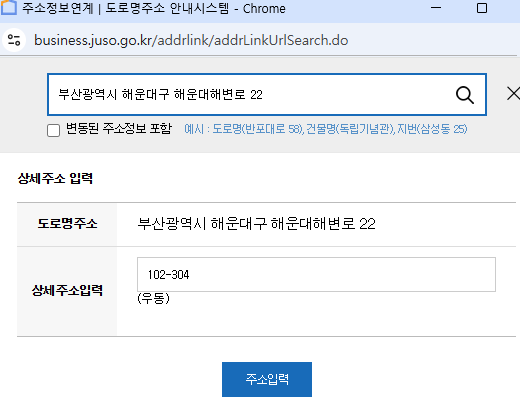
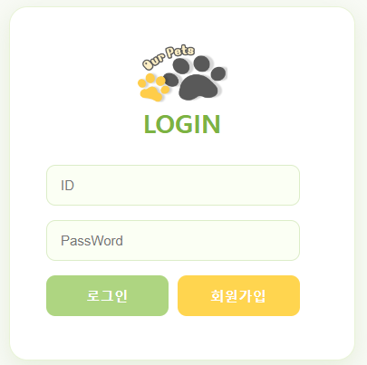
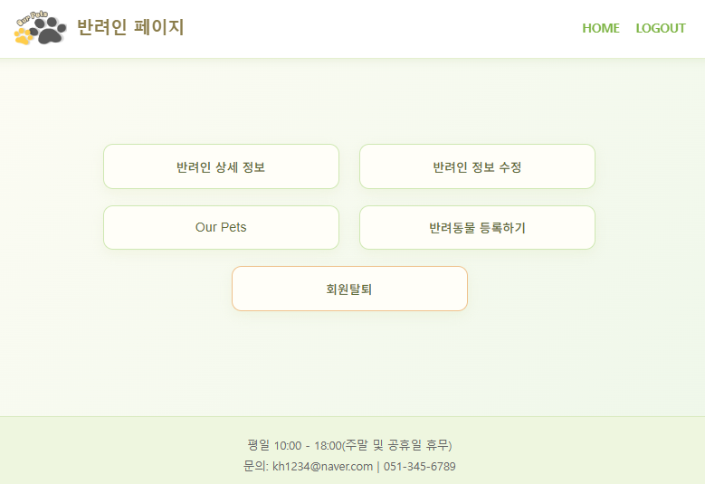
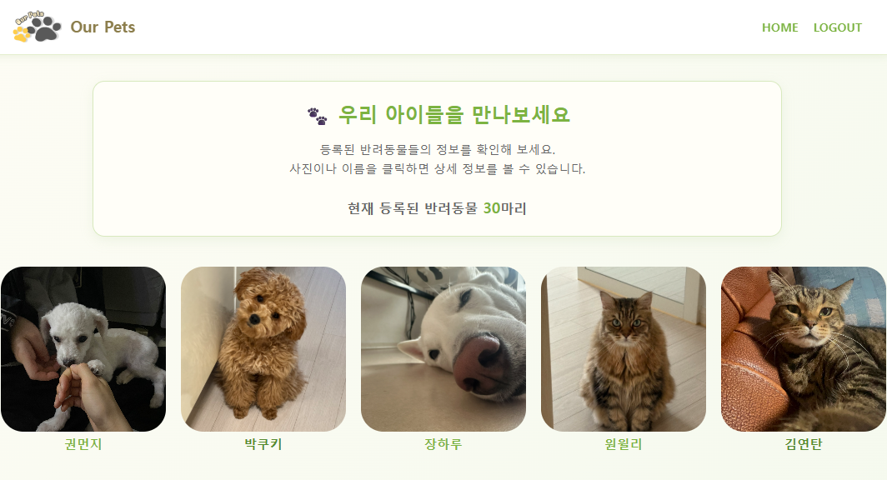
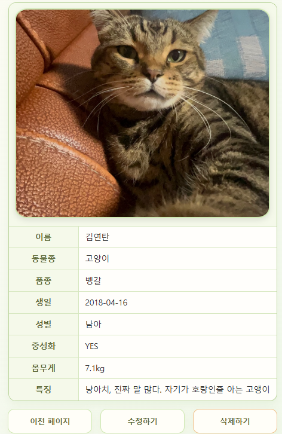
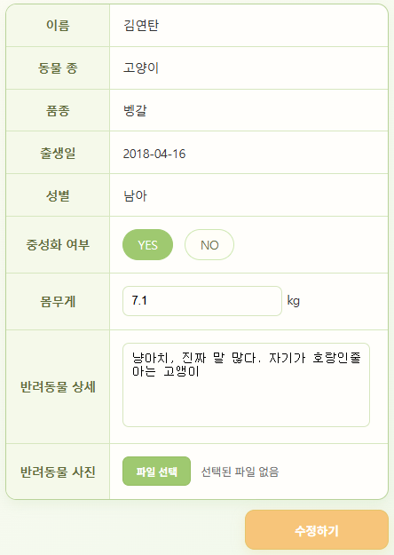
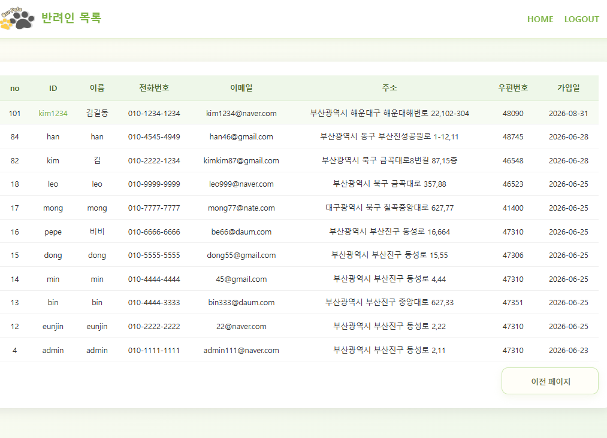

# 🐾 반려동물 등록 사이트

회원이 반려동물을 등록하고 관리하며, 다른 회원이 등록한 반려동물 정보를 조회할 수 있는 웹사이트입니다.

회원정보 및 반려동물 정보를 체계적으로 관리하고, 등록된 반려동물 목록과 상세 정보를 확인할 수 있도록 구현했습니다.

---

## 📌 프로젝트 개요

- **프로젝트명** : 반려동물 등록 사이트
- **프로젝트 기간** : 2026.06.22 ~ 2026.06.29
- **프로젝트 형태** : 개인 프로젝트

### 주제 선정 배경

반려인으로서 반려동물을 등록하고 사진과 정보를 공유하며, 다른 반려동물의 정보를 확인할 수 있는 서비스를 구현하고자 주제로 선정했습니다.

### 주요 목표

- 회원가입 및 회원정보 관리
- 반려동물 등록 및 정보 관리
- 등록된 반려동물 목록 및 상세 정보 조회
- 관리자 회원 관리 기능 구현
- Spring Boot 기반 웹 애플리케이션 개발 경험

---

## 🛠 사용 기술

### 사용 기술

- HTML
- CSS
- JavaScript
- Oracle
- JSP
- Spring Boot
- MyBatis
- Gradle
- Lombok
- Spring Security

### 개발 도구

- Eclipse
- SQL Developer
- ERWin
- VS Code
- GitHub
- Apache Tomcat

---

## 📅 프로젝트 진행 과정

```text
프로젝트 기획 및 주제 선정
        ↓
테이블 정의서 및 ER 다이어그램 작성
        ↓
개인 정보 및 이미지 데이터 준비
        ↓
Spring Boot 프로젝트 기능 구현
        ↓
테스트 및 결과 확인
        ↓
보고서 작성
```

---

## 🗃 데이터베이스 설계

### OWNER

회원가입 및 로그인에 필요한 회원 기본 정보를 관리합니다.

**주요 데이터**
- 회원번호
- 아이디
- 비밀번호
- 이름
- 연락처
- 이메일
- 주소
- 우편번호
- 가입일
- 권한

### PET

회원이 등록한 반려동물 정보를 관리합니다.

**주요 데이터**
- 반려동물 번호
- 이름
- 동물 종류
- 품종
- 생년월일
- 성별
- 중성화 여부
- 몸무게
- 상세정보
- 사진
- 등록일
- 회원번호

### 테이블 관계

```text
OWNER (1) ───────── (N) PET
```

한 명의 회원이 여러 반려동물을 등록할 수 있도록 `1:N` 관계로 설계했습니다.

---

## 🏗 프로젝트 구조

Spring Boot 기반의 계층형 구조로 구성했습니다.

```text
Controller
    ↓
Service
    ↓
DAO
    ↓
Mapper
    ↓
Oracle DB
```

- **Controller** : 사용자 요청 처리 및 화면 이동
- **Service** : 로그인 사용자 정보 처리 및 비즈니스 로직
- **DAO** : 데이터베이스 접근 및 MyBatis 연동
- **DTO** : 반려인·반려동물 데이터 객체
- **Mapper** : SQL을 통한 데이터 조회·등록·수정·삭제
- **Auth** : Spring Security 기반 로그인 및 권한 설정
- **View** : 관리자 및 회원 페이지
- **Static** : CSS, JavaScript, 이미지 등 정적 리소스 관리

---

# 💻 주요 기능

## 1. 회원가입 및 로그인

- 회원가입 기능
- 아이디 및 비밀번호 기반 로그인
- 회원가입 시 행정안전부 제공 API를 활용한 주소 검색
- Spring Security를 이용한 로그인 및 권한 관리
  
.png) 



---

## 2. 회원정보 관리

로그인한 회원이 자신의 정보를 조회하고 관리할 수 있습니다.

- 회원정보 조회
- 회원정보 수정
- 회원 탈퇴
- 반려동물 관리 페이지 이동

회원정보 수정 시 비밀번호 확인 후 수정할 수 있도록 구현했습니다.


 

---

## 3. 반려동물 목록 조회

회원들이 등록한 반려동물을 목록 형태로 확인할 수 있습니다.

- 등록된 반려동물 목록 조회
- 반려동물 이미지 표시
- 사진 또는 이름 클릭 시 상세정보 조회



---

## 4. 반려동물 등록

회원이 자신의 반려동물 정보를 등록할 수 있습니다.

**등록 정보**
- 이름
- 동물 종류
- 품종
- 생년월일
- 성별
- 중성화 여부
- 몸무게
- 상세정보
- 반려동물 사진


---

## 5. 반려동물 상세 조회 및 수정

등록된 반려동물의 상세정보를 조회하고 관리할 수 있습니다.

- 반려동물 상세정보 조회
- 반려동물 정보 수정
- 반려동물 삭제
- 사진 변경

 

---

## 6. 관리자 기능

관리자 권한으로 회원 정보를 관리할 수 있습니다.

- 회원 목록 조회
- 회원번호 및 아이디 클릭 시 회원 상세정보 조회
- 회원 삭제

Spring Security를 이용하여 일반 회원과 관리자의 접근 권한을 구분했습니다.



---

## ✨ 기대 효과

- 반려동물 정보 관리의 편의성 향상
- 반려동물 사진 및 정보 공유 활성화
- 반려인 간 교류 기회 제공
- 실제 웹사이트의 전반적인 개발 과정 경험

---

## 📝 개선 사항

프로젝트를 진행하면서 다음과 같은 개선점을 확인했습니다.

### 1. 회원 관리 페이지 구조 개선

회원 관리 과정에서 정보 상세·수정 페이지를 각각 구현했으나 일부 버튼을 제외하면 기능과 화면 구성이 유사했습니다.

향후에는 하나의 페이지를 공통으로 사용하고 권한에 따라 필요한 기능만 다르게 노출하도록 개선할 수 있습니다.

### 2. 이미지 관리 기능 개선

현재는 한 장의 이미지만 등록할 수 있습니다.

향후 여러 장의 사진을 등록하고 관리할 수 있도록 이미지 관리 기능을 확장하고자 합니다.

### 3. 반려동물 검색 및 필터링 기능 추가

반려동물의 종류와 품종 등 다양한 조건으로 원하는 반려동물을 쉽게 조회할 수 있도록 검색 및 필터 기능을 추가하고자 합니다.
