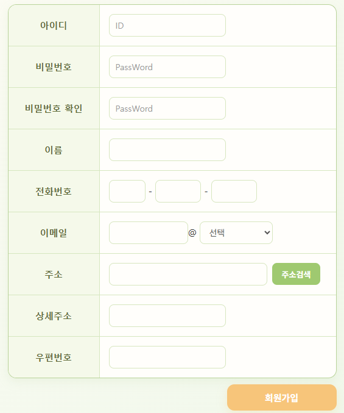
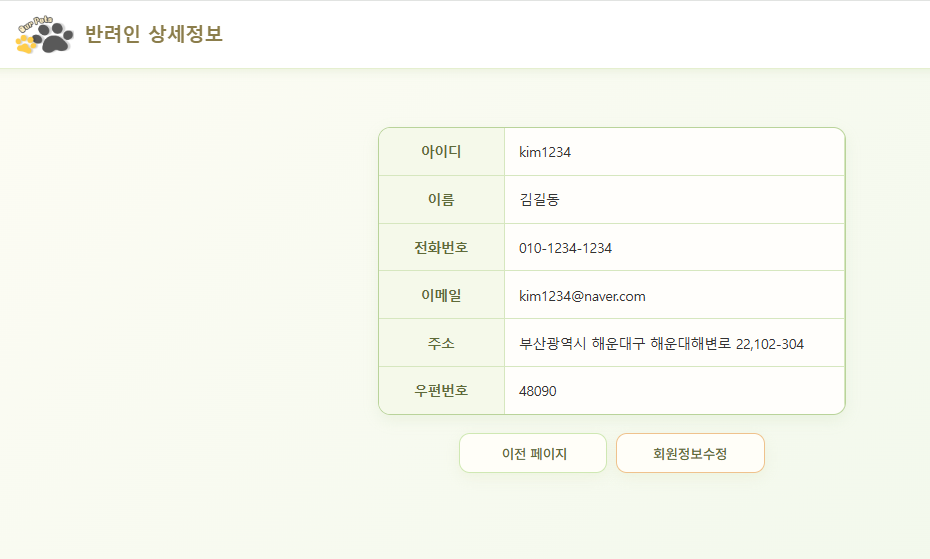
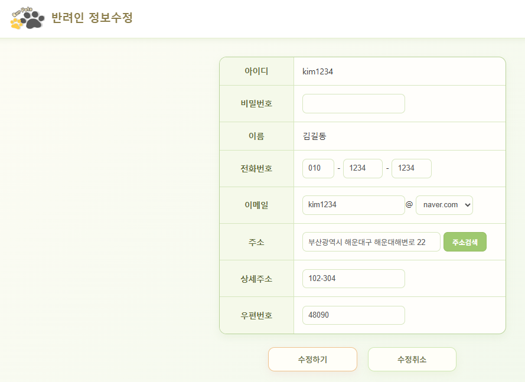
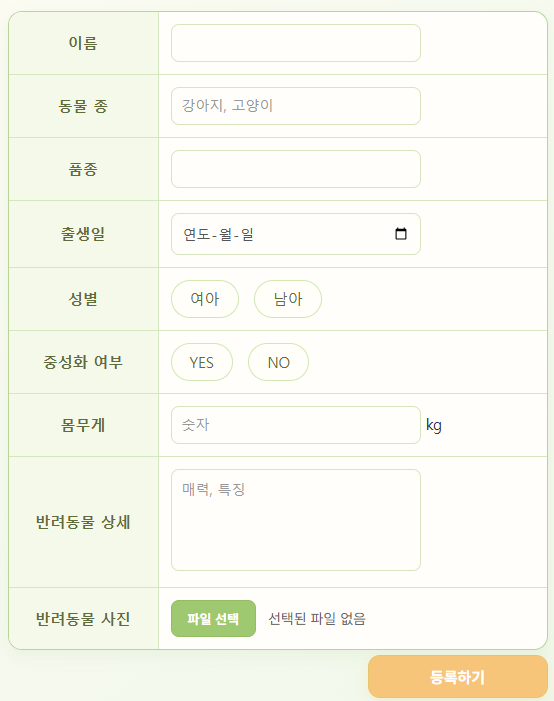

# 🐾 반려동물 등록 사이트

회원이 **반려동물**을 등록·관리하고, 
다른 회원이 등록한 반려동물 정보를 조회할 수 있는 Spring Boot 기반 웹사이트입니다.

---

## 프로젝트 개요

- **프로젝트명** : 반려동물 등록 사이트
- **프로젝트 기간** : 2026.06.22 ~ 2026.06.29
- **프로젝트 형태** : 개인 프로젝트

### 주제 선정 배경

반려인으로서 반려동물을 등록하고 사진과 정보를 공유하며, 다른 반려동물의 정보를 확인할 수 있는 서비스를 구현하고자 주제로 선정했습니다.

### 주요 목표

- 회원가입 및 회원정보 관리
- 반려동물 등록 및 정보 관리
- 등록된 반려동물 목록 및 상세 정보 조회
- 관리자 회원 관리 기능 구현
- Spring Boot 기반 웹 애플리케이션 개발 경험

---

### 사용 기술

- HTML
- CSS
- JavaScript
- Oracle
- JSP
- Spring Boot
- MyBatis
- Gradle
- Lombok
- Spring Security

### 개발 도구

- Eclipse
- SQL Developer
- ERWin
- VS Code
- GitHub
- Apache Tomcat(WAR 배포)

---

## 데이터베이스 설계

- `OWNER` : 회원 및 권한 정보 관리
- `PET` : 반려동물 기본 정보, 상세정보 및 이미지 관리
- `OWNER (1) : PET (N)` 관계로 한 회원이 여러 반려동물을 등록할 수 있도록 설계

---

## 프로젝트 구조

Spring Boot 기반의 계층형 구조로 구성했습니다.

Controller → Service → DAO → Mapper → Oracle DB

- MyBatis Mapper를 이용한 데이터 처리
- Spring Security를 이용한 인증 및 권한 관리
- JSP 기반 View 구성

---

# 주요 기능

## 1. 회원가입 및 로그인

- 회원가입 기능
- 아이디 및 비밀번호 기반 로그인
- 회원가입 시 행정안전부 제공 API를 활용한 주소 검색
- Spring Security를 이용한 로그인 및 권한 관리
  

  
  

---

## 2. 회원정보 관리

로그인한 회원이 자신의 정보를 조회하고 관리할 수 있습니다.

- 회원정보 조회
- 회원정보 수정
- 회원 탈퇴
- 반려동물 관리 페이지 이동

회원정보 수정 시 비밀번호 확인 후 수정할 수 있도록 구현했습니다.

  
  

  
  

---

## 3. 반려동물 목록 조회

회원들이 등록한 반려동물을 목록 형태로 확인할 수 있습니다.

- 등록된 반려동물 목록 조회
- 반려동물 이미지 표시
- 사진 또는 이름 클릭 시 상세정보 조회

---

## 4. 반려동물 등록

회원이 자신의 반려동물 기본정보와 사진을 등록할 수 있습니다.

---

## 5. 반려동물 상세 조회 및 수정

등록된 반려동물의 상세정보를 조회하고 관리할 수 있습니다.

- 반려동물 상세정보 조회
- 반려동물 정보 수정
- 반려동물 삭제
- 사진 변경

  
  

---

## 6. 관리자 기능

관리자 권한으로 회원 정보를 관리할 수 있습니다.

- 회원 목록 조회
- 회원번호 및 아이디 클릭 시 회원 상세정보 조회
- 회원 삭제

Spring Security를 이용하여 일반 회원과 관리자의 접근 권한을 구분했습니다.

  
  

---

## 개선 사항

- **회원 관리 페이지 구조 개선** : 유사한 상세·수정 페이지를 통합하여 중복 코드 개선
- **이미지 관리 개선** : 단일 이미지 등록에서 다중 이미지 등록·관리 기능으로 확장
- **검색 및 필터링 추가** : 종류와 품종을 기준으로 반려동물을 조회할 수 있는 기능 추가
